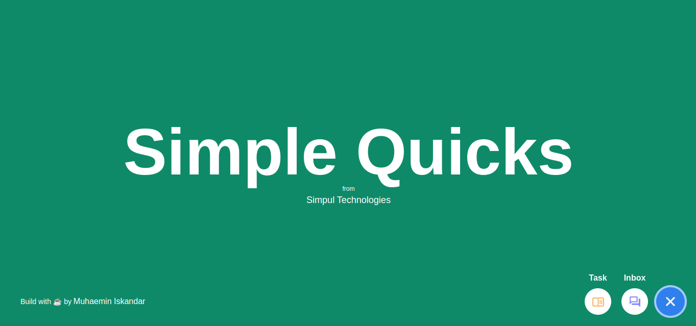

 

## Project Goals
I build this site as follow technical test of [Simpul Technologies](https://simpul.tech/). This site build a pop-up, called Quicks, comprising of two alternating tools:
  - Messaging
  - To Do List

The challenge is to implement and deploy a pixel-perfect interactive frontend application for Quicks.

## Tech Stack

- React + TypeScript + Vite (Main)
- Tailwind + DaisyUI + Flowbite + Framer Motion (UI)
- Get Stream Chat + Faker (Data)
- Zustand (State Management)
- etc. peer dependencies (see [package.json](./package.json))
